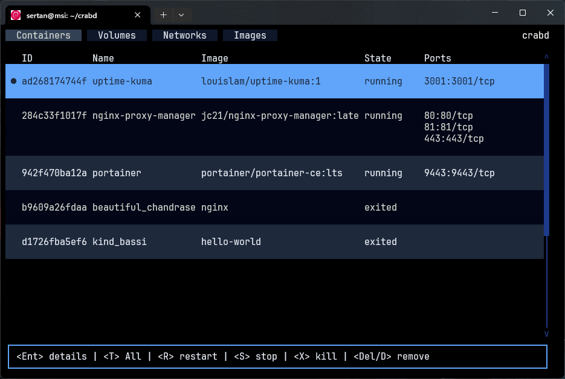

# crabd

A terminal-based Docker resource manager written in Rust. Easily view, manage, and control your Docker containers, images, networks, and volumes with a fast and intuitive TUI.



## Features

- List and manage Docker containers, images, networks, and volumes
- Start, stop, restart, kill, and remove containers
- Filter running/all containers
- Keyboard-driven navigation (see Keymap below)

## Requirements

- Docker daemon running on your system
- [Rust toolchain](https://rustup.rs/) (for building from source)

## Installation

### Cargo (Rust package manager):

```bash
cargo install crabd && crabd
```

### Build from source:

```bash
git clone https://github.com/scnplt/crabd.git && cd crabd
cargo run --release
```

## Keymap 

| Key     | Description      |
|---------|-----------------|
| J       | Down            |
| K       | Up              |
| Q       | Quit/Back       |
| T       | Show all/only running |
| R       | Start/Restart   |
| S       | Stop            |
| X       | Kill            |
| Del/D   | Remove          |

## Things To Do

- Code optimization and refactoring
- Add customization options (themes, keybindings, etc.)
- Improve error handling and user feedback
- Add more advanced filtering and search features
- Add tests and CI/CD pipeline

## Contributing

Contributions are welcome! Please open issues or pull requests on [GitHub](https://github.com/scnplt/crabd).

## License

Copyright (c) 2025 Sertan Canpolat (@scnplt)

Licensed under the [Apache License](./LICENSE), Version 2.0 (the "License");
you may not use this file except in compliance with the License.
You may obtain a copy of the License at

    http://www.apache.org/licenses/LICENSE-2.0

Unless required by applicable law or agreed to in writing, software
distributed under the License is distributed on an "AS IS" BASIS,
WITHOUT WARRANTIES OR CONDITIONS OF ANY KIND, either express or implied.
See the License for the specific language governing permissions and
limitations under the License.
